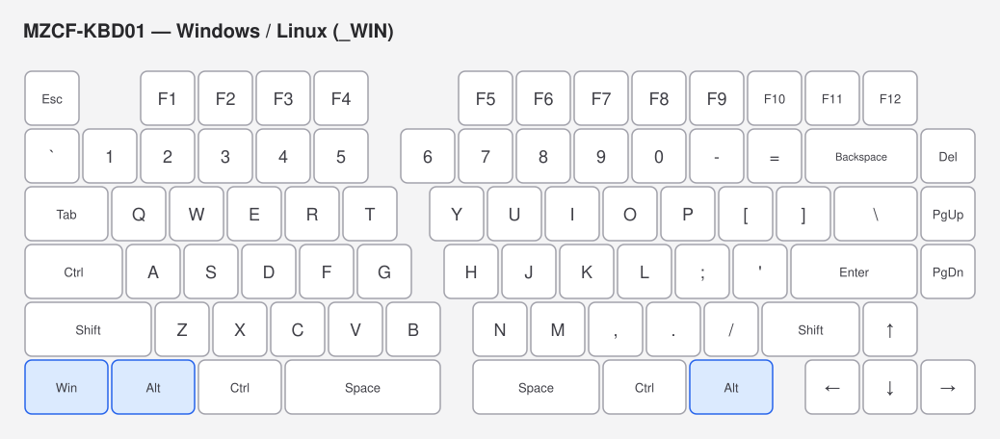
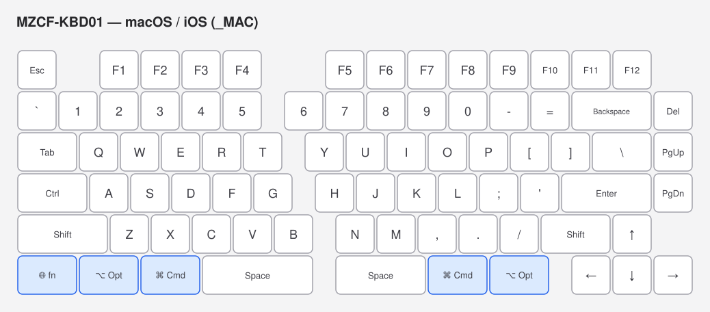

# MZCF-KBD01

RP2040-Zero を搭載した左右分割の自作キーボード。レイアウトは [ergogen](https://github.com/ergogen/ergogen) で生成し、KiCad 10 で設計しています。

## 構成

| パス | 内容 |
|---|---|
| `ergogen/` | ergogen 実行用ディレクトリ(レイアウト定義 `config.yaml`・カスタムフットプリント) |
| `pcb/` | KiCad プロジェクト(左: `MZCF-KBD01L.*`、右: `MZCF-KBD01R.*`)と部品ライブラリ |
| `cad/` | Plasticity 3D モデル |
| `firmware/` | QMK ファームウェア(キーボード定義・キーマップ) |

## 主要部品

- **MCU**: Waveshare RP2040-Zero(各手に1個)
- **ダイオード**: 1N4148W(SOD-123、裏面実装)
- **左右接続**: XH 2.54mm 4ピンコネクタ(5V / GND / GP28 / GP29)
- **スイッチ**: Cherry MX 互換(ソルダー)

## ファームウェア(QMK)

左右どちらの半分を USB 接続してもマスターとして動作します(EE_HANDS + SPLIT_USB_DETECT)。

ホスト OS を自動判別(QMK OS Detection)し、macOS / iOS 接続時は Alt と GUI を入れ替えたレイヤー(🌐 / Opt / Cmd の並び)に自動で切り替わります。それ以外(Windows / Linux / 判別不能時)は Windows 配列(Ctrl / Win / Alt)です。

Mac レイヤー左下の 🌐/fn キーは [tzarc/qmk_modules](https://github.com/tzarc/qmk_modules) の `globe_key` モジュール(コンシューマページ `AC Next Keyboard Layout Select` 0x029D を送信)によるもので、macOS に Globe キーとして認識されます。Apple 純正 fn の全機能(fn+矢印での PgUp/Home、fn+F キーの切り替え等)は再現されない簡易実装です。

### キーマップ





### ファームウェア構成

- 各半分に Waveshare RP2040-Zero(USB-C 搭載)
- マトリクス: COL0–8 = GP0–GP8 / ROW0–5 = GP9–GP14(COL2ROW、左右同一配線)
- 左右間通信: GP28 の単線ハーフデュプレックス(RP2040 PIO `vendor` ドライバ)。GP29 は予備
- ハンド判定ピンなし → EE_HANDS(初回書き込み時に EEPROM へ記録)

### セットアップ(初回のみ)

QMK CLI をインストールし、qmk_firmware を取得したうえで、`firmware/mzcf_kbd01` を symlink します。

```sh
brew install qmk/qmk/qmk        # または pipx install qmk
qmk setup -H ~/qmk_firmware
ln -sfn "$(pwd)/firmware/mzcf_kbd01" ~/qmk_firmware/keyboards/mzcf_kbd01   # リポジトリ root で実行

# コミュニティモジュール(Mac用 🌐/fn キーに使用)
git clone https://github.com/tzarc/qmk_modules.git ~/qmk_firmware/modules/tzarc
```

※ QMK External Userspace はキーマップ専用でキーボード定義を置けないため、symlink 方式にしています。キーボード定義の実体はこのリポジトリで管理されます。

### ビルド

```sh
qmk compile -kb mzcf_kbd01 -km default
# → ~/qmk_firmware/mzcf_kbd01_default.uf2
```

### 書き込み

初回(左右のハンド情報を書き込む・各半分1回だけ):

```sh
# 左手側
qmk flash -kb mzcf_kbd01 -km default -bl uf2-split-left
# 右手側
qmk flash -kb mzcf_kbd01 -km default -bl uf2-split-right
```

ブートローダへの入り方: RP2040-Zero の **BOOT** ボタンを押しながら USB を接続すると `RPI-RP2` ドライブがマウントされ、qmk が自動で書き込みます(UF2 のドラッグ&ドロップでも可)。

2回目以降:

```sh
qmk flash -kb mzcf_kbd01 -km default -bl uf2
```

ハンド情報は EEPROM(フラッシュエミュレーション)に保持されるため、通常の書き込みでは消えません。`flash_nuke.uf2` などでフラッシュを全消去した場合のみ、初回手順をやり直してください。

### 運用メモ

- USB を接続した側が自動的にマスターになります(SPLIT_USB_DETECT。接続後 2 秒ほどの判定時間があります)
- もう一方の半分は TRRS 経由で給電・通信されます
- **TRRS ケーブルの活線挿抜はしないでください**(5V が通っているため。抜き差しは USB を抜いた状態で)
- Bootmagic は無効化しています(EEPROM リセットでハンド情報が消えるのを防ぐため)。ブートローダには BOOT ボタンで入ってください

## ライブラリについて

`pcb/libs/lcsc/` のシンボル・フットプリントは LCSC / EasyEDA のデータを変換したものです。
